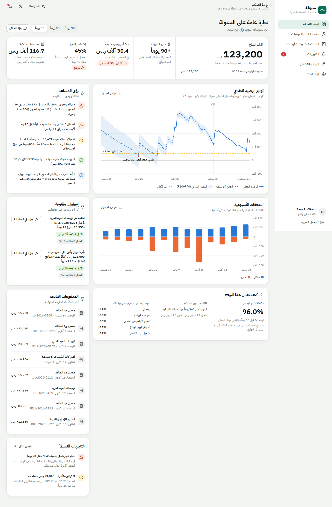
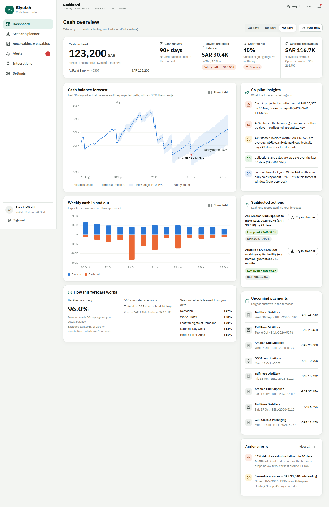
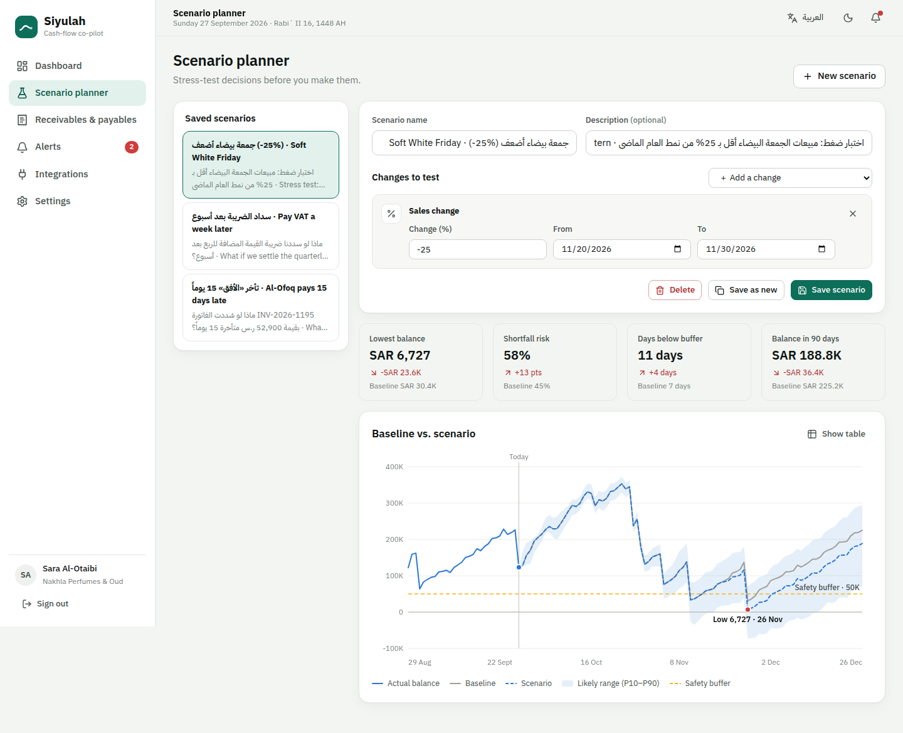
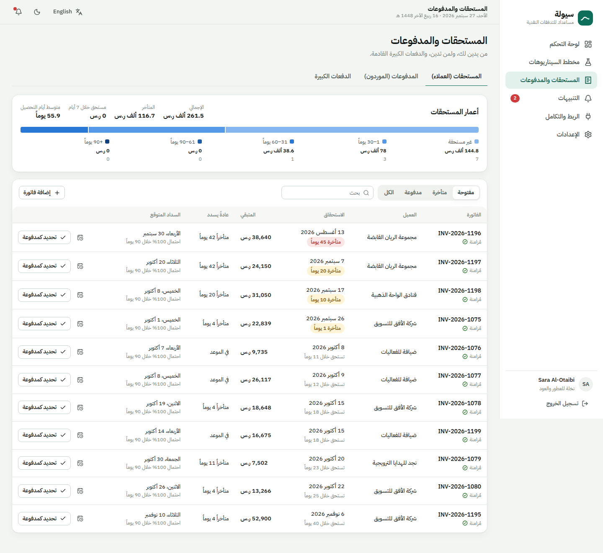
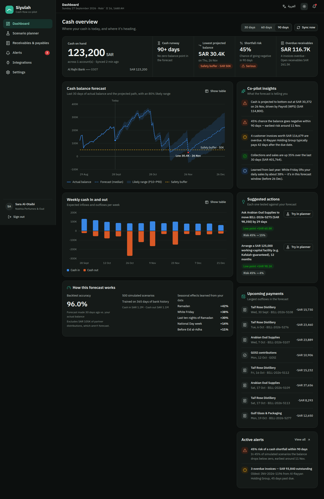
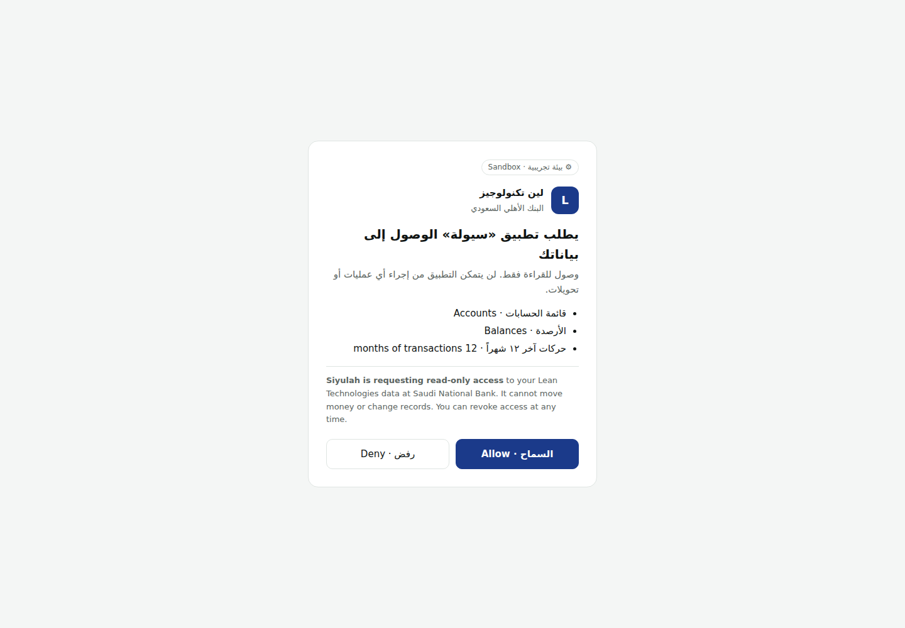
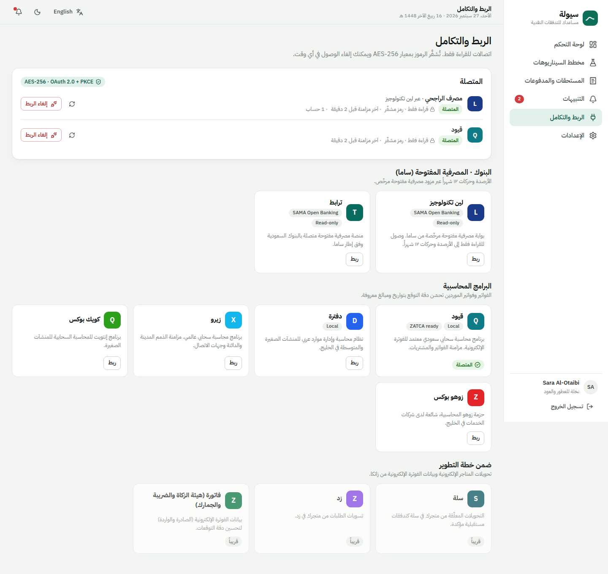
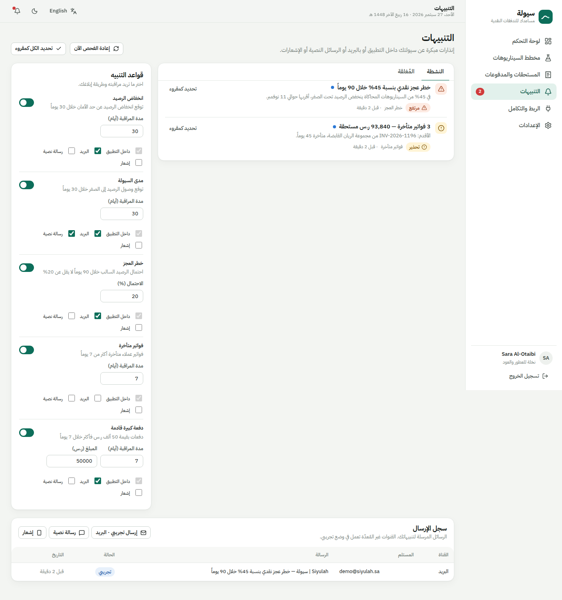

# Siyulah (سيولة) — SME Cash-Flow Forecaster

Siyulah is a cash-flow co-pilot for Saudi SMEs. It connects **read-only** to a company's bank accounts (SAMA open banking via Lean / Tarabut) and accounting software (Qoyod, Daftra, Xero, QuickBooks, Zoho Books). It learns the business's cash rhythm and forecasts the balance **30/60/90 days ahead**, and it flags shortfalls weeks before they happen. The whole app is **Arabic-first (RTL)** with a full English mode.

| Arabic (RTL) | English |
|---|---|
|  |  |

> This is an MVP. Bank and accounting integrations run against a built-in **sandbox**: it follows the real OAuth 2.0 + PKCE flow and serves a realistic simulated Saudi SME, so the whole product can be used end to end without partner credentials. See [Going live](#going-live).

---

## Try it

```bash
./scripts/start.sh          # builds the SPA and serves everything on http://localhost:8000
```

Click **"Explore the live demo"** (or sign in with `demo@siyulah.sa` / `demo1234`). The demo company is *Nakhla Perfumes & Oud (نخلة للعطور والعود)*, a Riyadh perfume retailer that sells in-store (mada) and on Salla. It has Al Rajhi (via Lean) and Qoyod connected.

To see onboarding, **create an account** instead: choose retail or services, connect a bank on the sandbox consent screen, then your accounting software.

Other ways to run it:

```bash
./scripts/dev.sh            # API with auto-reload on :8000 + Vite on :5173 → open http://localhost:5173
docker compose up --build   # single container on :8000 (set SIYULAH_ENCRYPTION_KEY / SIYULAH_JWT_SECRET)
./scripts/test.sh           # backend tests + frontend typecheck/build
```

Requirements: Python 3.11+, Node 20+.

---

## What the MVP covers (BRD → implementation)

| BRD requirement | In the MVP |
|---|---|
| **Open banking integration** (SAMA framework, Lean / Tarabut) | OAuth 2.0 authorization code + PKCE (S256), consent screen, single-use codes, refresh tokens, pick from 10 Saudi banks, read-only scopes. Balances plus 12 months of transactions are synced and auto-categorised (English and Arabic statement rules: mada, Salla, WPS, GOSI, Ejar, SADAD/ZATCA…). |
| **Accounting sync** (Xero, QuickBooks, Zoho, Daftra, Qoyod) | Same OAuth flow. Receivables and payables sync with due dates, VAT and ZATCA e-invoice UUIDs. Bank and accounting views reconcile. |
| **Predictive dashboard** (past 30 days + next 30/60/90) | Actual balance for the last 30 days and the forecast median with an 80% likely range (P10–P90). Also: runway, lowest projected balance, shortfall probability, weekly cash in/out, backtest accuracy, and the seasonal effects the model learned. |
| **Scenario planning engine** | 11 levers: customer pays late / on a date / never; move a supplier payment; move or skip a major payment (VAT, rent…); sales or spending change for a date range; one-off items; new recurring costs (hires); financing with amortised installments. Baseline vs. scenario is compared on the same simulated paths. Scenarios can be saved. |
| **Smart alerts** (push, SMS, email) | Rules for low balance, cash runway ("Warning: 15-day cash runway remaining"), shortfall risk, overdue invoices and large upcoming payments. Each rule has configurable thresholds and channels, plus deduplication, escalation, auto-resolve, a delivery log and test sends. SMTP and an SMS gateway are pluggable; channels without credentials run in sandbox mode. |
| **Payables / receivables tracker** | Aging buckets, DSO, overdue flags, each customer's usual lateness, the forecast's expected payment date and probability, promised/planned dates, mark paid, manual invoices. Major obligations are **auto-detected** from bank data: payroll (WPS, 27th), GOSI, Ejar rent and the next ZATCA VAT (estimated from the quarter). |
| **Arabic/English, RTL** | Complete Arabic and English UIs. Charts mirror time in RTL. Hijri (Umm al-Qura) and Gregorian dates, Latin digits, bidi-safe amounts (`‎-12,500 ر.س`). |
| **Security & compliance** | AES-256-GCM encryption at rest for tokens, IBANs and phone numbers; scrypt passwords; JWT; PKCE; strict redirect-URI checks; login throttling; security headers; audit log. PDPL: explicit consent at sign-up, data-residency label, a one-click JSON export (right of access), account erasure, and imported data is deleted on disconnect. |
| **Roadmap items** | Salla / Zid payouts and ZATCA Fatoora appear in the catalogue as "coming soon". |

Small changes from the BRD, same approach:

- Suggested actions: the co-pilot doesn't only warn. It tries concrete levers through the engine (renegotiate a bill, collect overdue invoices, Kafalah-backed financing) and shows the measured effect on the low point and on risk.
- Honest accuracy: the dashboard shows a real backtest. It re-runs the full pipeline as of 30 days ago and scores it against what actually happened, which is the "test accuracy against their Excel models" step from the beta phase.

---

## How the forecast works

`backend/app/services/forecasting.py` is pure (no database access) and explainable:

1. **Known flows are scheduled exactly.** These are open supplier bills, payroll, GOSI, rent, ZATCA VAT, zakat, financing and any scenario items. Recurring payments move to the previous business day on the Saudi Fri/Sat weekend and bank holidays.
2. **Receivables are probabilistic.** Each customer's history of *days paid after due date* is an empirical distribution that gets sampled per simulation. Overdue invoices are conditioned on the time already elapsed, and long-overdue ones carry a default probability.
3. **Day-to-day flows are learned.** POS and online sales and variable spending are modelled with a **ridge-regularised Poisson GLM (log link)** on Saudi calendar features: weekday, the 27th payday window, Ramadan, the last ten nights, Eid, pre-Eid al-Adha, National Day, Founding Day and White Friday. Hijri dates come from `hijridate`. Multiplicative residuals are bootstrapped, so the spread comes from data.
4. **Future invoices are phased in.** Payments from invoices that don't exist yet are added using the historical run-rate, weighted by the empirical issue-to-payment lag. Near-term cash comes from today's open invoices; later cash comes from the pipeline.
5. **Monte Carlo** (500 paths) gives P10/P50/P90 balances, runway, the date and size of the low point, and the probability of going negative. Random streams are keyed per component (common random numbers), so a scenario differs from the baseline *only* by the scenario.

On the demo company the sales model's backtest accuracy is about 87% on weekly totals. The full-pipeline 30-day balance backtest is about 96%, excluding partner distributions, which are discretionary and not forecast.

---

## Architecture

```
frontend/  React 18 + TypeScript + Vite · React Query · custom SVG charts · IBM Plex Sans Arabic
  src/i18n/            ar.ts / en.ts dictionaries, formatters (Hijri, compact SAR, bidi isolation)
  src/components/charts BalanceChart (history + fan chart + scenario compare), WeeklyFlows, AgingBar
  src/pages/           Dashboard · Scenarios · Tracker · Alerts · Integrations (+ onboarding, OAuth callback) · Settings
  e2e/smoke.mjs        Playwright walkthrough (both languages, dark mode, mobile, full OAuth onboarding)

backend/   FastAPI · SQLAlchemy 2 · NumPy
  app/services/forecasting.py     forecasting engine (pure)
  app/services/calendar_ksa.py    Saudi business calendar & Hijri seasons
  app/services/obligations.py     payroll / GOSI / rent / VAT detection
  app/services/categorizer.py     bank-line categorisation (EN + AR)
  app/services/insights.py        bilingual insights + measured suggested actions
  app/services/alerts.py          rules → alerts → notifier (email / SMS / push)
  app/services/sync.py            provider sync, idempotent upserts
  app/integrations/sandbox*.py    OAuth + data sandbox and the simulated SME ("world")
  app/api/*                       REST API (OpenAPI docs at /docs)
```

The API serves the built SPA, so production is a single process or container. SQLite is the default; point `SIYULAH_DATABASE_URL` at PostgreSQL for multi-instance deployments.

### Configuration

Every setting is an environment variable with the `SIYULAH_` prefix (see `backend/.env.example`).

| Variable | Purpose |
|---|---|
| `SIYULAH_ENCRYPTION_KEY` | base64 32-byte AES-256 key. **Required in production.** In development one is generated in `backend/data/dev-secrets.json`. |
| `SIYULAH_JWT_SECRET` | Token signing secret. **Required in production.** |
| `SIYULAH_FRONTEND_URL` | Public URL of the app; the OAuth redirect target (`…/integrations/callback`). |
| `SIYULAH_DATABASE_URL` | SQLAlchemy URL (default SQLite in `backend/data`). |
| `SIYULAH_SMTP_*`, `SIYULAH_SMS_*` | Real alert delivery; empty means sandbox mode. |
| `SIYULAH_ALERTS_INTERVAL_MINUTES` | Background re-sync and alert evaluation (default 360). |
| `SIYULAH_TODAY` | Freeze "today" for demos and tests. |

---

## Testing

- **Backend:** `cd backend && python -m pytest`, 53 tests covering:
  - the engine: learning weekday effects, exact scheduling, customer-delay behaviour, scenario directions, runway and shortfall, pipeline phase-in, common random numbers
  - the Saudi calendar
  - security: scrypt, AES-GCM tamper detection, the PKCE RFC vector, tokens encrypted in the DB
  - the categoriser
  - sandbox consistency: bank ↔ accounting reconciliation, valid Saudi IBAN checksums, realistic balances
  - API flows: onboarding through the consent screen, single-use codes, PKCE and redirect-URI enforcement, tenant isolation, PDPL export and erasure, login throttling
- **Frontend:** `npm run build` (strict TypeScript).
- **End to end:** start the app, then `cd frontend && BASE_URL=http://127.0.0.1:8000 node e2e/smoke.mjs`. It walks through every page in both languages, dark mode and a 390px phone. It also registers a company and connects a bank and Qoyod through the consent screens, and it fails on any console error or horizontal overflow.

## Going live

The provider boundary is `ProviderClient` in `backend/app/integrations/providers.py` (authorize URL, code exchange, refresh, accounts, transactions, invoices). Swapping the sandbox for a live partner means:

1. Implement the client against the partner API (e.g. Lean's or Tarabut's AIS endpoints; Qoyod, Xero or Zoho REST).
2. Register the redirect URI with the partner and put the client credentials in secrets.
3. Point `client_for()` in `services/sync.py` at the live client for that provider.

Sync, categorisation, obligation detection, forecasting and alerts don't change.

Production checklist: PostgreSQL in a KSA region, a KMS-managed encryption key, TLS termination, httpOnly-cookie sessions (the MVP keeps the JWT in `localStorage`), a real SMS gateway (Unifonic/Taqnyat), web-push keys, and a SAMA CSF control review.

## Roadmap

- ZATCA Fatoora e-invoice ingestion; Salla / Zid pending-payout sync
- Accountant / fractional-CFO multi-company workspace (the BRD's channel partners)
- Natural-language co-pilot ("why is November tight?") on top of the existing engine
- Scenario sharing and PDF board packs

---

<details>
<summary>More screenshots</summary>

| | |
|---|---|
|  |  |
|  |  |
|  |  |

</details>
